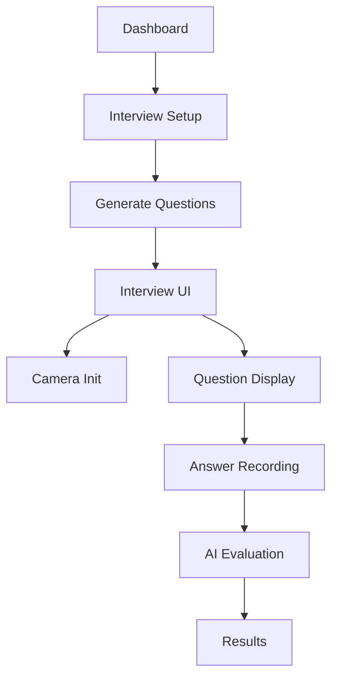
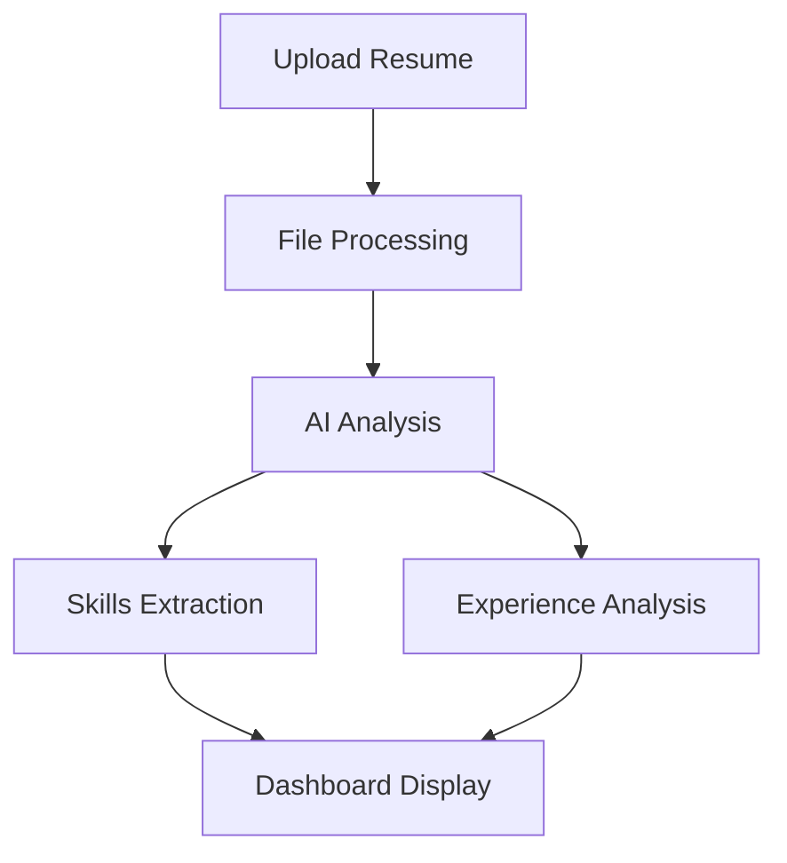
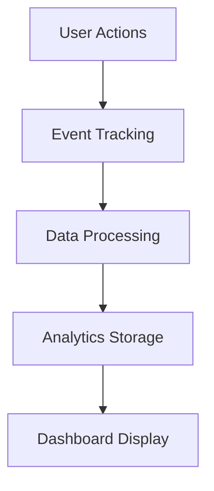

# Application Flow Documentation

## User Journey and File Flow

### 1. Authentication Flow

```mermaid
graph TD
    A[Login Page] --> B[/api/auth/login]
    B --> C{Auth Success?}
    C -->|Yes| D[Home Dashboard]
    C -->|No| A
    E[Signup Page] --> F[/api/auth/signup]
    F --> C
```

#### Files Involved:

1. `/src/app/login/page.tsx`

   - Handles login form
   - Manages auth state
   - Redirects to dashboard

2. `/src/app/signup/page.tsx`

   - New user registration
   - Field validation
   - Account creation

3. `/src/app/api/auth/[...routes].ts`
   - Login/signup logic
   - JWT token generation
   - Session management

### 2. Interview Flow



#### Files and Dependencies:

1. **Interview Setup**

   - `/src/app/home/dashboard/page.tsx`
     ```typescript
     // Initiates interview setup
     const startInterview = async () => {
       router.push("/interview/setup");
     };
     ```

2. **Question Generation**

   - `/src/app/api/interview/generate-questions/route.js`
     - Calls Gemini API
     - Structures questions
     - Returns question set

3. **Interview UI**

   - `/src/components/InterviewUI.tsx`
     ```typescript
     // Main interview component flow
     const InterviewUI = () => {
       // 1. Camera initialization
       useInterviewMonitoring();

       // 2. Question management
       useQuestionFlow();

       // 3. Answer handling
       useAnswerProcessing();
     };
     ```

4. **Camera Monitoring**

   - `/src/hooks/useInterviewMonitoring.ts`
     - Initializes MediaPipe
     - Manages camera stream
     - Handles face detection

5. **Answer Processing**
   - `/src/app/api/interview/answer/route.js`
     - Receives answers
     - Calls Gemini API
     - Returns evaluation

### 3. Resume Analysis Flow



#### Files Involved:

1. **Resume Upload**

   - `/src/app/home/upload-resume/page.tsx`
   - `/src/components/ResumeUpload.tsx`
   - `/src/app/api/resume/upload/route.js`

2. **Analysis**
   - `/src/app/api/resume/analyze/route.js`
   - `/src/lib/resume-analyzer.ts`

### 4. Analytics Flow



#### Component Interaction:

1. **Event Collection**

   - `/src/components/InterviewUI.tsx`
   - `/src/components/QuestionsSections.tsx`
   - `/src/components/RecordAnswerSection.tsx`

   ```typescript
   // Event tracking
   const trackEvent = async (eventType, data) => {
     await fetch("/api/analytics", {
       method: "POST",
       body: JSON.stringify({ type: eventType, data }),
     });
   };
   ```

2. **Data Processing**

   - `/src/app/api/analytics/route.js`
   - `/src/lib/analytics-processor.ts`

3. **Display**
   - `/src/app/home/analytics/page.tsx`
   - `/src/components/AnalyticsCharts.tsx`

### 5. State Management Flow

```typescript
// Example of state flow between components

// 1. Interview Context
// /src/contexts/InterviewContext.tsx
export const InterviewContext = createContext({
  state: initialState,
  dispatch: () => null,
});

// 2. Component Usage
// /src/components/InterviewUI.tsx
const { state, dispatch } = useContext(InterviewContext);

// 3. State Updates
dispatch({
  type: "UPDATE_ANSWER",
  payload: { questionId, answer },
});

// 4. Effects
useEffect(() => {
  if (state.answerSubmitted) {
    processAnswer();
  }
}, [state.answerSubmitted]);
```

### 6. Component Communication

#### Parent-Child Flow

```typescript
// /src/components/InterviewUI.tsx -> RecordAnswerSection.tsx
<RecordAnswerSection
  onAnswerSubmit={handleAnswerSubmit}
  onRecordingComplete={handleRecordingComplete}
/>;

// /src/components/RecordAnswerSection.tsx
const RecordAnswerSection = ({ onAnswerSubmit, onRecordingComplete }) => {
  // Implementation
};
```

### 7. Data Flow

#### Database Operations Flow

```typescript
// 1. API Route
// /src/app/api/interview/[interviewId]/route.js
export async function GET(req, { params }) {
  const { interviewId } = params;

  // 2. Database Query
  const interview = await prisma.interview.findUnique({
    where: { id: interviewId },
    include: {
      questions: true,
      answers: true,
    },
  });

  // 3. Response
  return NextResponse.json(interview);
}

// 4. Client Usage
// /src/app/interview/[interviewId]/page.tsx
const fetchInterview = async () => {
  const response = await fetch(`/api/interview/${interviewId}`);
  const data = await response.json();
  setInterviewData(data);
};
```

### 8. Error Handling Flow

```typescript
// Global Error Handling
// /src/app/error.tsx
export default function GlobalError({
  error,
  reset,
}: {
  error: Error & { digest?: string };
  reset: () => void;
}) {
  return (
    <div>
      <h2>Something went wrong!</h2>
      <button onClick={() => reset()}>Try again</button>
    </div>
  );
}

// Component Error Boundaries
// /src/components/ErrorBoundary.tsx
class ErrorBoundary extends React.Component {
  componentDidCatch(error, errorInfo) {
    // Log error to analytics
    logError(error, errorInfo);
  }
}
```

### 9. Authentication Flow

```typescript
// 1. Login Request
// /src/app/login/page.tsx
const login = async (credentials) => {
  const response = await fetch("/api/auth/login", {
    method: "POST",
    body: JSON.stringify(credentials),
  });

  if (response.ok) {
    router.push("/home/dashboard");
  }
};

// 2. Auth Middleware
// /src/middleware.ts
export function middleware(request: NextRequest) {
  const token = request.cookies.get("token");

  if (!token && isProtectedRoute(request.nextUrl.pathname)) {
    return NextResponse.redirect(new URL("/login", request.url));
  }
}
```

This documentation outlines the major flows and interactions between different parts of the application. Each section shows how data and control flows between components, API routes, and the database.
